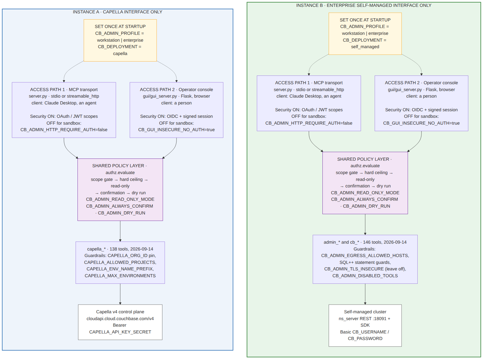
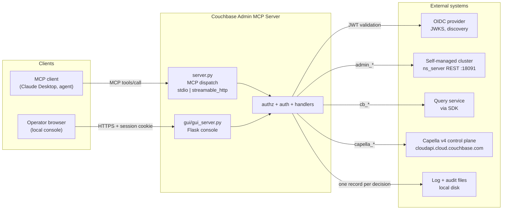
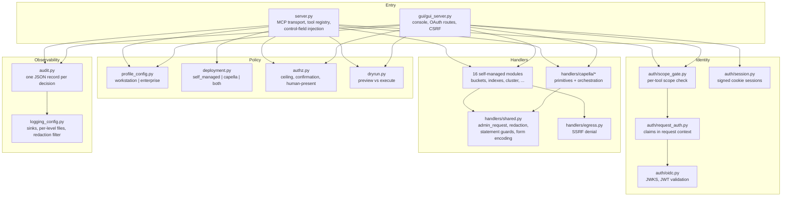
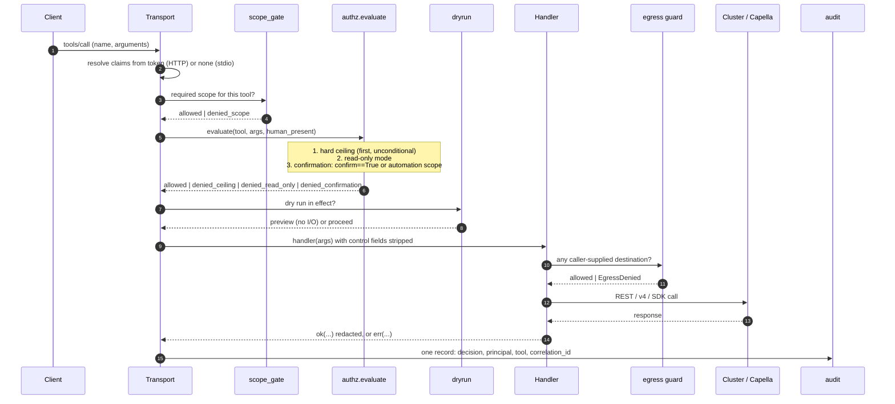
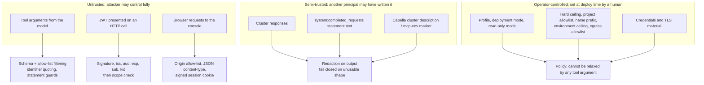
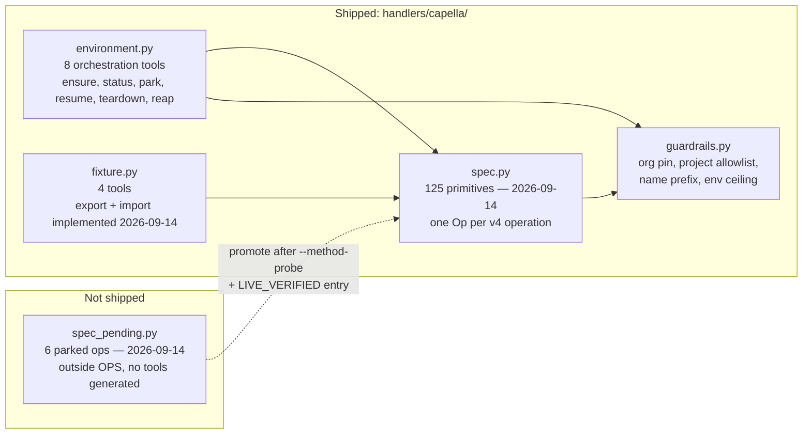
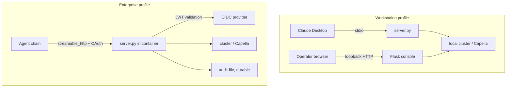

# Couchbase Admin MCP Server: Architecture

Written 2026-08-17. Re-measured 2026-09-14 against **284 registered tools** —
138 `capella_*`, 127 `admin_*`, 19 `cb_*` — across 16 self-managed handler
modules and 5 shipped Capella modules.

This document describes what the server is, what it talks to, how a tool call is
authorized, and where the trust boundaries sit. Diagrams are Mermaid, so they
render in GitHub and diff as text. The PNG figures under `docs/diagrams/` are the
same diagrams rendered for the PDF and slide builds; their sources are the
`.mmd` files under `docs/diagrams-src/`, regenerated on 2026-09-14 from the same
measurements as this file. Where any two disagree, this file is authoritative,
because it is the one that changes with the code.

---

## 1. What this is

An MCP server that administers Couchbase. It exposes three families of tool,
distinguished by prefix, because they reach three different systems over three
different protocols with three different credentials:

| Prefix | Reaches | Transport | Credential |
| --- | --- | --- | --- |
| `admin_*` | Self-managed cluster, ns_server REST | `https://<node>:18091` | HTTP Basic, `CB_USERNAME`/`CB_PASSWORD` |
| `capella_*` | Capella v4 control plane | `https://cloudapi.cloud.couchbase.com/v4` | Bearer, `CAPELLA_API_KEY_SECRET` |
| `cb_*` | Query service and server introspection | Couchbase SDK / query | Cluster credentials, or none |

The split is load-bearing. `handlers/shared.admin_request` and
`handlers/capella/client.capella_request` are separate functions with separate
retry policies, separate TLS stories and separate pagination, because the two
planes agree on none of those things.

### 1.1 Two admin interfaces, and one instance manages one of them

The three prefixes resolve into **two admin interfaces**:

| | Interface 1: Capella | Interface 2: Enterprise self-managed |
| --- | --- | --- |
| Tools | `capella_*` (74) | `admin_*` and `cb_*` (134) |
| Endpoint | `cloudapi.cloud.couchbase.com/v4` | `https://<node>:18091` plus the SDK |
| Credential | Organization API key SECRET | Cluster administrator, HTTP Basic |
| Set | `CB_DEPLOYMENT=capella` | `CB_DEPLOYMENT=self_managed` |
| Own guardrails | org pin, project allowlist, name prefix, environment ceiling | egress allowlist, SQL++ statement guards, TLS verification, disabled-tool list |

**One running instance manages one interface. To administer both, run two
instances.** That is deployment guidance rather than a code restriction, since
`CB_DEPLOYMENT=both` exists and works. Section 7 records why the guidance is
what it is, and how `auto` can select `both` without anyone asking for it.

`cb_*` is the only family that loads in both interfaces: SQL++ inference,
`system:indexes`, `EXPLAIN`, `ADVISE` and the completed-requests advisors need no
administration REST API at all.

### 1.2 Two access paths into each instance

Whichever interface an instance manages, it can be driven two ways: the MCP
transport in `server.py`, or the Flask operator console in `gui/gui_server.py`.
Both converge on the same `authz.evaluate` and the same handlers, and each path
has **its own authentication that can be switched off independently** for
sandbox work (`CB_ADMIN_HTTP_REQUIRE_AUTH` for path 1,
`CB_GUI_INSECURE_NO_AUTH` for path 2). The security posture is therefore a
2 x 2: two interfaces, two paths, relaxable per path.

---

## 2. System context: what the server connects to

Two things follow from this diagram.

**There are two dispatch paths, not one.** The MCP transport and the Flask
console both reach the same handlers through the same `authz.evaluate`. Every
control implemented in one path must be implemented in the other, and a single
shared dispatch preamble is what keeps that true as either path changes.

**The only outbound destinations are the four on the right.** Anything else a
tool tries to reach is an SSRF, which is what `handlers/egress.py` exists to
refuse.

---

## 3. Module map

`profile_config` writes into `os.environ` at import time, which makes import
order load-bearing: every consumer of a profile-supplied variable must import
after it. Both entry points do this correctly today, and the scan verified it
module by module.

---

## 4. The authorization pipeline

This is the sequence every tool call passes through. Each gate assumes the
previous one has run.

**The hard ceiling runs first and unconditionally.** It is what makes unattended
automation safe: a tool named in `CB_ADMIN_ALWAYS_CONFIRM` cannot be satisfied by
`confirm: true` or by an automation scope. Note that the ceiling can only ever be
*tightened* by configuration, never loosened.

**Dry run runs after every gate**, so a preview cannot be used to inspect a tool
the caller is not permitted to call.

**Redaction is applied on the way out**, in both `ok()` and `err()`, so a secret
echoed by the cluster does not reach the model.

---

## 5. Trust boundaries

**No policy value is readable or writable from a tool argument.** A caller cannot self-promote out of the sandbox. The scan tested this
directly against the org pin, the project allowlist, the name prefix and the
automation claim, and all four hold.

The semi-trusted row is the one to watch. A Capella cluster `description` carrying
an `mcp-env:` marker is written by this server but can be edited by anyone with
Capella access, so ownership decisions re-fetch and re-validate rather than
trusting a cached marker.

---

## 6. Capella layering

The Capella side has three tiers plus a quarantine. Conflating them is the most
likely way to misuse it.

**Primitives are thin.** One tool per v4 operation, no orchestration. Use when you
know exactly which call you want.

**Orchestration sequences primitives** and enforces ordering constraints the
individual tool descriptions do not expose: an App Service must be deleted
before its cluster, and a resume must be polled to healthy.

**Nothing enters `OPS` without live verification.** `spec.LIVE_VERIFIED` records
an observed HTTP status per operation, and a test asserts the record and the
registry agree exactly. That test exists because a commit message once claimed all
paths were verified while ten were not.

### Verified Capella facts, 2026-08-17

Established by live probe against organization `Field Engineering`, cluster on
Couchbase Server 8.0.2:

* `POST .../clusters/{cluster_id}/backups/{backup_id}/restore` exists. Its body
  carries `sourceClusterId`, and Capella **requires that to match the cluster in
  the path** (error code 5026). A `targetClusterId` is silently ignored.
  **Cross-cluster restore is therefore not a v4 primitive.** This is the one
  Disney requirement with no API workaround, and the reason the fixture layer
  exists. See `docs/FIXTURE_DESIGN.md`.
* `.../clusters/{c}/backups` and `.../clusters/{c}/replications` both answer 200.
* `.../clusters/{c}/eventing/functions` does **not** route.
  `.../clusters/{c}/eventingFunctions` does.
* `.../clusters/{c}/queryIndexes` does **not** route.
  `.../clusters/{c}/queryService/indexes` does.

The last two mean the pending eventing and query-index ops carry wrong paths and
must be repathed before promotion, not filed as gaps.

---

## 7. Deployment topologies

The profile is one stated decision rather than the accidental sum of eight
variables, and it has **no default**: an unset `CB_ADMIN_PROFILE` is fatal at
startup. Workstation assumes a human is present on stdio; enterprise assumes an
unattended, OAuth-authenticated chain and refuses the shortcuts workstation
allows.

`deployment.py` is the orthogonal axis: the profile decides how much is refused,
the deployment mode decides what is loaded. Either profile is valid with either
interface, so there are four supported combinations and each one is an instance.

**`CB_ADMIN_PROFILE=enterprise` has nothing to do with the Enterprise
self-managed interface.** The collision is unfortunate and worth stating plainly:

| The question it answers | Variable | Values |
| --- | --- | --- |
| Is a human watching at the moment of the call? | `CB_ADMIN_PROFILE` | `workstation` \| `enterprise` |
| What does this instance administer? | `CB_DEPLOYMENT` | `capella` \| `self_managed` |

`enterprise` as a *profile* means **unattended**: an agent chain acting on an
IdP-issued token, no person at the keyboard. Couchbase Server Enterprise Edition
self-hosted is `CB_DEPLOYMENT=self_managed`. There is deliberately **no `capella`
profile**: whether you are administering Capella is a question about the target,
whether someone is present to approve a bucket deletion is a question about the
caller, and collapsing them would forbid both a laptop driving Capella and an
unattended pipeline driving a lab cluster. All four combinations are supported.

`workstation` is named after the **caller**, not the cluster: a laptop or a
container driven by Claude Desktop over stdio, no IdP, identity is the OS user,
and `confirm: true` is a real second look because the MCP client puts each call
in front of a person. `enterprise` is the opposite caller: authorization already
happened when the IdP issued the child agent a token carrying the automation
scope, so `confirm: true` means nothing there, because the model supplies it.

What each profile *sets* (only where the operator left it unset; explicit always
wins):

| Variable | `workstation` | `enterprise` |
| --- | --- | --- |
| `CB_ADMIN_TRANSPORT` | `stdio` | (unset) |
| `CB_ADMIN_HOST` | `127.0.0.1` | (unset) |
| `CB_ADMIN_HTTP_REQUIRE_AUTH` | `false` | `true` |
| `OAUTH_ENABLED` | (unset) | `true` |
| `CB_GUI_INSECURE_NO_AUTH` | `1` | `0` |
| `CB_ADMIN_READ_ONLY_MODE` | `false` | `false` |
| `CB_ADMIN_EGRESS_ALLOW_ANY` | `false` | `false` |
| `CB_ADMIN_LOG_SINKS` | (unset) | `stderr,file` |
| `CB_ADMIN_AUDIT_FILE` | (unset) | `/var/log/couchbase-admin-mcp/audit.log` |

Note the two rows that are identical: read-only mode is off and egress fails
closed in *both*. The profile is not a safe/unsafe switch. It describes who is
calling, and some controls do not depend on that at all.

### 7.1 Set `CB_DEPLOYMENT` explicitly

| Value | Loads | Use it when |
| --- | --- | --- |
| `capella` | `capella_*` and `cb_*` | This instance administers a Capella organization. **Recommended.** |
| `self_managed` | `admin_*` and `cb_*` (134) | This instance administers a self-managed cluster. **Recommended.** |
| `both` | everything, gated nothing | Not recommended; see below. |
| `auto` | inferred from credentials present | Not recommended in a deployment; see below. |

`both` is a real code path with a real use, and tests cover it. It is still not
how this should be deployed, for three reasons:

* It puts **two credential sets in one process**, so a compromise or a
  misconfiguration reaches two planes instead of one.
* It makes the loaded tool list **a superset to search rather than an assertion
  to check**. In a single-interface instance, a `capella_*` tool appearing where
  you expected `admin_*` is itself the error message.
* **Half the guardrails go inert.** `CAPELLA_ALLOWED_PROJECTS` constrains
  nothing on a self-managed cluster; `CB_ADMIN_EGRESS_ALLOWED_HOSTS` constrains
  nothing on the v4 control plane. A configuration that looks fully guarded is
  half guarded, and which half depends on which tool is called.

**The path into `both` is not choosing it; it is not choosing anything.**
`detect_mode()` resolves `CAPELLA_API_KEY_SECRET` plus a non-Capella
`CB_CONNECTION_STRING` to `both`. So an instance intended for a self-managed
cluster, whose `.env` still carries a Capella key from earlier work, silently
loads EVERY tool from both planes (280 as of 2026-09-14) and the
one-interface-per-instance boundary is gone with no
warning at the point of use. The inference is defensible in isolation, because
an operator who configures both plainly intends both, but naming the mode
removes it. `CB_DEPLOYMENT_GATE=false` is a further escape hatch with the same effect;
prefer `both`, which is the explicit spelling and appears in the startup summary.

### 7.2 Security on and off, per access path

The relaxations are per path, not per interface: the same variables apply
whichever interface the instance manages. Two properties make offering them
safe: each is a named variable that has to be set deliberately, and the
enterprise profile refuses to start when the dangerous ones are set.

| Variable | Path / layer | Sandbox | Default | Enterprise profile |
| --- | --- | --- | --- | --- |
| `CB_ADMIN_HTTP_REQUIRE_AUTH` | path 1, MCP over HTTP | `false` | `true` on http | **fatal** if not true |
| `OAUTH_ENABLED` | path 1, token validation | `false` | off on stdio | needs issuer + audience |
| `OAUTH_SKIP_VERIFY` | path 1, token validation | never | `false` | **fatal in every profile** |
| `CB_GUI_INSECURE_NO_AUTH` | path 2, operator console | `true` | `false` | **fatal** if true |
| `CB_ADMIN_READ_ONLY_MODE` | shared policy layer | `false` | `true` | allowed, audited |
| `CB_ADMIN_ALWAYS_CONFIRM` | shared policy layer | `false` | `true` | allowed, audited |
| `CB_ADMIN_DRY_RUN` | shared policy layer | `true` | `false` | allowed |
| `CB_ADMIN_TLS_INSECURE` | outbound to cluster | `true` | `false` | **fatal** if true |
| `CB_ADMIN_EGRESS_ALLOW_ANY` | outbound egress guard | `true` | `false` | **fatal** if true |
| `CAPELLA_ALLOW_UNSCOPED_DESTRUCTIVE` | Capella guardrails | `true` | `false` | allowed, audited |
| `CB_ADMIN_WORKSTATION_CONTAINER_BIND` | workstation bind check | `true` | unset | not consulted |

The most privileged configuration in the codebase is reachable by setting the
profile that sounds safest: `workstation` with an HTTP transport bound to
`0.0.0.0` is unauthenticated network-reachable destructive admin, because every
workstation relaxation is justified by the claim that a human is at the client
and no port is exposed. A non-loopback bind now fails at startup unless
`CB_ADMIN_WORKSTATION_CONTAINER_BIND` acknowledges it. The realistic path there
is not an attacker choosing those values; it is an operator copying a dev
compose file into a data centre.

Going back to secure is one variable. Set `CB_ADMIN_PROFILE=enterprise` and
start. Validation refuses the eight combinations that cannot be secure (HTTP
auth off, console auth off, egress unrestricted, TLS verification off, missing
`OAUTH_ISSUER`, missing `OAUTH_AUDIENCE`, no durable audit sink, and
`OAUTH_SKIP_VERIFY`), and the startup error names each one and why.

---

## 8. Observability

One audit record per decision, from both dispatch paths, as a single JSON line so
that CR/LF in any field is escaped by the encoder rather than by a filter.
Records carry the decision, the tool, the resolved principal, the deployment mode
and a caller-supplied `correlation_id` that is sanitized and never consulted for
authorization.

Logging is separate from audit: sinks are selectable (`stderr`, `file`), per-level
files are written with `O_NOFOLLOW` and mode 0600 preserved across rotation, and a
record filter masks credentials and flattens CR/LF in the message. Tracebacks and
string log arguments pass through the same filter, so neither can carry an
unmasked credential or an unflattened newline into a log line.

---

## 9. Where to read next

| Question | File |
| --- | --- |
| How do I run it, what are the profiles and layers? | `README.md` |
| Operational procedures | `RUNBOOK.md` |
| Portable, taggable datasets across clusters | `docs/FIXTURE_DESIGN.md` |
| Capella v4 operations written but not shipped, and why each is parked | `handlers/capella/spec_pending.py` |
| How a v4 path earns its `[LIVE]` tag | `scripts/verify_capella_paths.py` |
| What has been measured, and on what date | `docs/CB_Admin_MCP_Architecture.docx`, section 9 |
| Contributing, tests, tagging conventions | `CONTRIBUTING.md` |
